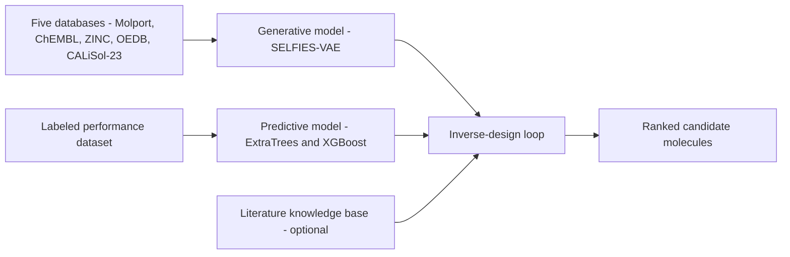
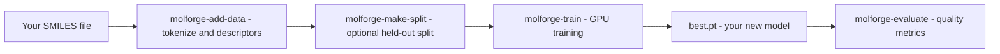
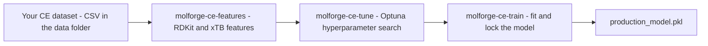
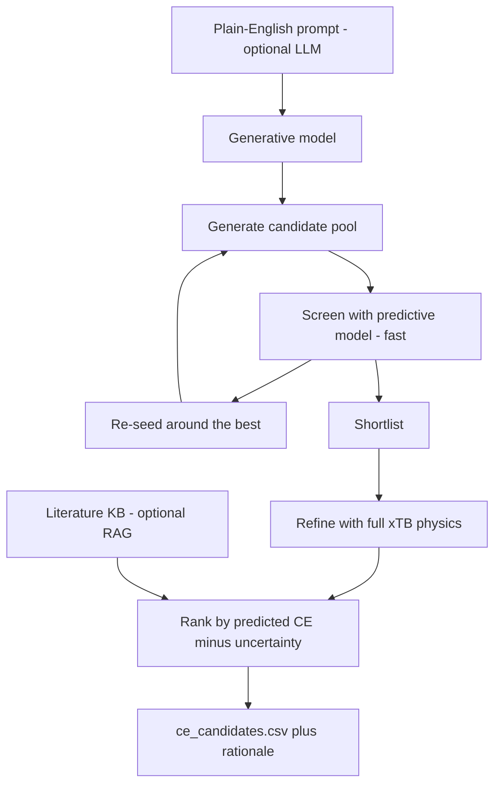

# MolForge

MolForge is an AI toolkit for **inventing new molecules** and **designing better battery
electrolyte additives**. It pairs a pretrained generative model (it dreams up novel, valid
molecules) with a predictive model (it estimates how well a molecule will perform) and ties
them together into an automated inverse-design loop.

Under the hood the generator is a *conditional variational autoencoder* trained on
**9,135,485 molecules curated from five public chemistry databases** (Molport, ChEMBL, and
ZINC for broad chemical coverage, plus electrolyte data from OEDB and CALiSol-23), using
[SELFIES](https://github.com/aspuru-guzik-group/selfies) so that **almost every structure it
produces is chemically valid**. It learns a smooth map of chemical space that you can sample,
search, and steer toward properties you care about — and a paired electrolyte property model
ranks candidates by predicted battery-relevant performance.



This guide is written so that someone with limited programming experience can run each part.
Follow the steps in order, and copy-paste the commands.

---

## Training data and provenance

MolForge was **not** trained on a single source. The generator was trained on **9,135,485
molecules** drawn from five public databases, filtered (3-60 heavy atoms, organic elements)
and de-duplicated:

| Database | Molecules used | Role |
|---|---|---|
| Molport "All Stock" | 6,088,143 | core corpus of purchasable molecules |
| ChEMBL-37 | 2,800,000 | bioactive chemical diversity |
| ZINC | 227,902 | additional lead-like diversity |
| OEDB | 5,616 | electrolyte diversity |
| CALiSol-23 | 13,824 | electrolyte diversity |
| **Total (generator)** | **9,135,485** | |

OEDB and CALiSol-23 are *electrolyte* datasets: beyond a handful of solvent molecules, they
contribute **18,918 electrolyte formulations** (ionic conductivity, ion coordination,
viscosity) used to train the separate **electrolyte property model**, which scores generated
molecules for battery-relevant performance across cations (Li / Na / K / Mg / Zn / ...). This is
how MolForge targets **battery electrolytes** rather than only general organic chemistry: the
generator proposes structures, and the electrolyte model - grounded in real measured and
simulated electrolyte data - ranks them.

> Want a broader generator? You can train on the full ChEMBL set and add your own molecules
> (Workflow C). Electrolyte chemical space itself is small - solvents and salts number in the
> hundreds, not millions - so MolForge specializes toward electrolytes through the property
> model and optional fine-tuning rather than by training the generator on millions of
> electrolytes (which do not exist).

## How MolForge differs from existing models

- **A latent space, not left-to-right text generation.** Autoregressive models (e.g.
  ElectrolyteGPT, MolGPT) emit one token at a time. MolForge's VAE gives a continuous latent
  space you can **interpolate** and **optimize with gradients** - for example "increase
  molecular weight by 10 while keeping everything else," which a token model cannot do.
- **Validity by construction.** Because it decodes SELFIES, essentially **100%** of generated
  strings are valid molecules (measured validity 1.000), versus SMILES-based models that
  routinely emit invalid strings.
- **A complete inverse-design system, not just a generator.** MolForge pairs the generator with
  a **predictive model** (with Optuna tuning), an **electrolyte property model**, optional
  **LLM** guidance, and a **literature-grounded** retrieval step - an end-to-end loop from a
  plain-English request to a ranked, scored candidate list.
- **Electrolyte-formulation awareness.** Conductivity, coordination, and viscosity are *system*
  properties; MolForge models them at the formulation level (multi-cation), grounded in OEDB
  and CALiSol-23 data - most molecule generators ignore this entirely.
- **Open and laptop-friendly.** Runs on an ordinary CPU, installs with `pip`, and the weights
  are openly available.

---

## Table of contents

- [Training data and provenance](#training-data-and-provenance)
- [How MolForge differs from existing models](#how-molforge-differs-from-existing-models)

1. [What you can do](#1-what-you-can-do)
2. [What you need](#2-what-you-need)
3. [Setup, step by step](#3-setup-step-by-step)
4. [Workflow A: Generate molecules with the trained model](#4-workflow-a-generate-molecules-with-the-trained-model)
5. [Encode, decode, and score molecules](#5-encode-decode-and-score-molecules)
6. [Workflow B: Fine-tune the model on your own molecules](#6-workflow-b-fine-tune-the-model-on-your-own-molecules)
7. [Workflow C: Train the generative model from scratch](#7-workflow-c-train-the-generative-model-from-scratch)
8. [Workflow D: Train the predictive model with Optuna tuning](#8-workflow-d-train-the-predictive-model-with-optuna-tuning)
9. [Workflow E: Run the full inverse-design pipeline](#9-workflow-e-run-the-full-inverse-design-pipeline)
10. [The literature knowledge base (RAG)](#10-the-literature-knowledge-base-rag)
11. [Enabling natural-language features (LLM keys)](#11-enabling-natural-language-features-llm-keys)
12. [The web app](#12-the-web-app)
13. [Project layout](#13-project-layout)
14. [Command reference](#14-command-reference)
15. [Troubleshooting](#15-troubleshooting)
16. [License and attribution](#16-license-and-attribution)

---

## 1. What you can do

- **Generate** new, valid, novel molecules, optionally aimed at target properties (Workflow A).
- **Fine-tune** the trained model on your own molecules (Workflow B).
- **Train** a fresh generative model from scratch on your own data (Workflow C).
- **Train a predictive model**, with automatic Optuna hyperparameter tuning (Workflow D).
- **Run the full inverse-design pipeline** to propose and rank candidate additives, optionally
  guided by plain-English requests and grounded in your own literature (Workflows E and 10).

Everything runs on an ordinary laptop. A computer with an NVIDIA GPU is faster but not required.

---

## 2. What you need

- **Python 3.10 or newer.** Check with `python --version`.
- **About 1 GB of free disk space** for the model weights and dependencies.
- **(Optional) An NVIDIA GPU** for faster generation and training.
- **(Optional) The xTB program** ([install guide](https://xtb-docs.readthedocs.io/)) only for
  the quantum-chemistry features (full-accuracy predictive model, or DFT grounding).
- **(Optional) Language-model API keys** only for the natural-language and literature features
  (Sections 10 and 11).

The core generative features need none of the optional items.

---

## 3. Setup, step by step

### Step 1 - Install Python

If `python --version` is below 3.10, install it from
[python.org/downloads](https://www.python.org/downloads/). On Windows, check
"Add Python to PATH" during installation.

### Step 2 - Download the code

```bash
git clone https://github.com/NealKapadia/molforge.git
cd molforge
```

(No git? Use the green "Code" button on GitHub, then "Download ZIP", unzip, and open a
terminal in that folder.)

### Step 3 - (Recommended) Create a clean environment

```bash
python -m venv molforge-env
# Activate it:
#   Windows (PowerShell):  molforge-env\Scripts\Activate.ps1
#   macOS / Linux:         source molforge-env/bin/activate
```

### Step 4 - Install MolForge

```bash
pip install .            # core: generate, encode/decode, score, fine-tune
pip install ".[full]"    # everything: predictive model, web app, training tools, reports
```

Installing also creates short commands such as `molforge`, `molforge-train`, and
`molforge-ce-design` (used throughout this guide). You can install one capability at a time,
for example `pip install ".[ce]"` (predictive model) or `pip install ".[app]"` (web app).

> **NVIDIA GPU users:** install the CUDA build of PyTorch *first*, then the command above:
> `pip install torch --index-url https://download.pytorch.org/whl/cu124`

### Step 5 - Get the model weights

The trained weights (about 0.5 GB) live on Hugging Face, separate from the code. The easiest
option is to let the code download them automatically on first use (Workflow A). To download
them yourself into a folder you control:

```python
from huggingface_hub import snapshot_download
print("Weights at:", snapshot_download("NealKapadia/Molforge"))
```

This folder holds `checkpoints/best.pt` (the model) and `processed/` (vocabulary and
normalization files). The code finds it automatically; you can also set the environment
variable `MOLVAE_ART_DIR` to point at it.

> **Tip for the training, fine-tuning, and predictive workflows:** those write new files into
> the weights folder, so use a **writable copy** rather than the read-only download cache.
> Stage one once:
> ```bash
> python -c "from huggingface_hub import snapshot_download; import shutil; shutil.copytree(snapshot_download('NealKapadia/Molforge'),'artifacts',dirs_exist_ok=True)"
> ```
> then point at it:
> `export MOLVAE_ART_DIR="$PWD/artifacts"` (Windows PowerShell: `$env:MOLVAE_ART_DIR = "$PWD\artifacts"`).

---

## 4. Workflow A: Generate molecules with the trained model

The quickest check, from the command line:

```bash
molforge --n 20
molforge --n 10 --spec '{"MolWt":250,"NumAromaticRings":1}'
molforge --n 10 --device cuda --out molecules.csv
```

Or from Python - create `try_it.py` and run `python try_it.py`:

```python
from huggingface_hub import snapshot_download
from molforge import MolForge

# Loads the model (downloads weights on first run). Use device="cuda" if you have a GPU.
mf = MolForge(device="cpu", artifacts_dir=snapshot_download("NealKapadia/Molforge"))

print(mf.generate(10))                                    # 10 valid, novel molecules
print(mf.generate(5, spec={"MolWt": 300, "QED": 0.8}))    # aimed at target properties
for row in mf.generate(5, with_properties=True):          # molecules plus their properties
    print(row)
```

Property targets are *soft*: the model moves toward them but does not hit them exactly. For
strict requirements, generate extra molecules and filter by their computed properties.

---

## 5. Encode, decode, and score molecules

```python
z = mf.encode("OCCN(CCO)CCO")   # molecule -> 256-number latent vector
mf.decode(z)                     # latent vector -> molecule
mf.properties("CCO")             # standard RDKit descriptors
mf.predict_properties("CCO")     # the model's own property predictions
```

To explore variations around a molecule, encode it, nudge the vector, and decode:

```python
import numpy as np
z = mf.encode("CC(=O)[O-]")
for _ in range(10):
    print(mf.decode(z + np.random.randn(*z.shape).astype("float32") * 0.6))
```

---

## 6. Workflow B: Fine-tune the model on your own molecules

Fine-tuning adapts the trained model toward your chemistry. It builds its training set
directly from a text file of SMILES, so it does **not** need the original training data.

1. Put your molecules in a file, one SMILES per line, e.g. `my_molecules.smi`.
2. Point `MOLVAE_ART_DIR` at a **writable** copy of the weights (see the tip in Step 5).
3. Fine-tune:

```bash
molforge-finetune --input my_molecules.smi --epochs 3          # add --device cuda for a GPU
molforge-finetune --input solvents.csv --smiles-col 0 --header --delim ,   # CSV input
```

The result is saved as `artifacts/checkpoints/finetuned.pt`. Use it:

```python
from molforge import MolForge
mf = MolForge(device="cpu", ckpt="artifacts/checkpoints/finetuned.pt")
print(mf.generate(20))
```

A pure-CPU laptop handles a few thousand molecules and a few epochs comfortably (just more
slowly than a GPU). Your molecules are filtered by the same rules as the base model (3 to 60
heavy atoms, common organic elements); the run prints how many survived.

---

## 7. Workflow C: Train the generative model from scratch

Use this to build a brand-new model on your own dataset instead of adapting the existing one.
A GPU is strongly recommended; on CPU it is only practical for small datasets.



1. Choose a writable output folder for all artifacts:

   ```bash
   export MOLVAE_ART_DIR="$PWD/my_model"     # Windows PowerShell: $env:MOLVAE_ART_DIR = "$PWD\my_model"
   ```

2. Convert your SMILES into training data (this also builds the vocabulary and the property
   normalization statistics):

   ```bash
   molforge-add-data --input mydata.smi --tag mydata --recompute-stats
   ```

3. (Optional but recommended) Create an honest held-out validation split:

   ```bash
   molforge-make-split
   ```

4. Train. The model checkpoints periodically and can be stopped and resumed at any time:

   ```bash
   molforge-train --epochs 6 --batch 320          # lower --batch on small GPUs
   molforge-train --resume                         # continue a stopped run
   ```

   The best checkpoint is saved as `best.pt` in your artifacts folder.

5. Check quality against standard generative metrics:

   ```bash
   molforge-evaluate
   ```

Your new model loads exactly like the pretrained one:
`MolForge(ckpt="my_model/checkpoints/best.pt")`.

---

## 8. Workflow D: Train the predictive model with Optuna tuning

The predictive model estimates a performance property (by default Coulombic Efficiency, CE)
from a molecule's structure. It needs the `ce` extra (`pip install ".[ce]"`), your labeled
dataset, and, for the physics-based features, the xTB program.



1. **Provide your dataset.** Put a single CSV in a `data/` folder (the tools detect it
   automatically), or pass `--csv your.csv`, or set the `MOLVAE_CE_CSV` environment variable.
   The CSV needs a SMILES column and a measured-CE column; see
   [`data/README.md`](data/README.md) for the expected column names. Then build the feature
   table (this runs xTB once per molecule and caches it, so re-runs are fast):

   ```bash
   molforge-ce-features                       # auto-detects the CSV in data/
   # or:  molforge-ce-features --csv path/to/your.csv
   ```

2. **Tune hyperparameters with Optuna.** It searches many settings and keeps the best,
   scoring on both random and scaffold splits for an honest estimate:

   ```bash
   molforge-ce-tune
   ```

3. **Train and save** the final predictor using the tuned settings:

   ```bash
   molforge-ce-train
   ```

   The model is written to `<artifacts>/ce/production_model.pkl`, and the run prints honest
   accuracy (R-squared) for both random and scaffold splits.

**Important limitation:** the predictor learns from measured data and cannot reliably predict
values *higher* than the best it has seen. In practice the ceiling for brand-new molecules is
around 97.6% CE, even though some known additives reach 98 to 99%. The dependable way past
that ceiling is to measure a promising candidate, add the measurement, and retrain:

```bash
molforge-ce-features --append-smiles "<SMILES>" --append-ce 98.5
molforge-ce-train
```

---

## 9. Workflow E: Run the full inverse-design pipeline

With the generative model (Workflow A or C) and the predictive model (Workflow D) in place,
this closes the loop: it generates many candidates, screens them with the predictor, re-seeds
generation around the best, refines the shortlist with full xTB physics, and writes a ranked
list of proposed additives.



Basic run:

```bash
molforge-ce-design --n 1200 --rounds 3 --shortlist 60 --top 30 --out ce_candidates.csv
```

The output `ce_candidates.csv` ranks candidates by predicted performance minus an uncertainty
penalty, with their properties and (where available) their Molport catalog IDs.

Guide the search with plain English and add a language-model review of each candidate (needs
the keys from Section 11):

```bash
molforge-ce-design --prompt "water-stable zinc additive, molecular weight under 200" --llm
```

Ground the explanation of the top candidate in your own literature and flag novelty against it
(needs a knowledge base, see Section 10):

```bash
molforge-ce-design --prompt "amide additive for zinc anode SEI" --llm --rag
```

See `molforge-ce-design --help` for all options (round count, shortlist size, uncertainty
penalty `--lam`, minimum-CE filter `--min-ce`, and more).

---

## 10. The literature knowledge base (RAG)

The optional knowledge base lets the pipeline ground its explanations in real papers and notes
*you* provide, and flag candidates that are too similar to already-published work. It uses
text embeddings, so it needs the embedding key from Section 11.

**Where the files live:** the knowledge base is stored under your artifacts folder at
`<MOLVAE_ART_DIR>/ce/kb/` (created automatically). You do not place files there by hand - you
add them with the commands below, which read, chunk, and embed your text.

**Add documents** (plain-text papers, abstracts, or your own notes). Use `--source` to label
where each came from so citations are meaningful:

```bash
# add a text file (export a paper to .txt first):
molforge-ce-rag --add paper.txt --source "Zhang 2024 JACS"

# add a quick note directly:
molforge-ce-rag --add-text "TFE additive raises Zn CE to 99.4% by reshaping the SEI." --source "lab note"
```

**Inspect and search** the knowledge base:

```bash
molforge-ce-rag --list                                  # what is in the KB
molforge-ce-rag --query "amide additives for zinc SEI" --k 5    # top 5 relevant passages
```

**Use it in the pipeline** by adding `--rag` to a design run (Section 9). The top candidate's
explanation will cite retrieved passages, and the output CSV gains a `lit_novelty` column
(higher means less similar to anything in your knowledge base, i.e. more novel):

```bash
molforge-ce-design --prompt "amide additive for zinc anode SEI" --llm --rag
```

By default the knowledge base is capped at 10 documents (a safety limit for shared
deployments). Raise it for local use by setting `CE_RAG_MAX_SOURCES`, e.g.
`export CE_RAG_MAX_SOURCES=200`.

---

## 11. Enabling natural-language features (LLM keys)

The `--llm`, `--rag`, and web-app "explain" features use a language model and text embeddings.
These are optional and off by default; without keys, the pipeline still runs (it falls back to
keyword matching and skips the literature grounding).

1. Copy the example configuration:

   ```bash
   cp .env.example .env       # Windows: copy .env.example .env
   ```

2. Open `.env` in a text editor and fill in your keys. The file supports Azure AI Foundry and
   Azure OpenAI endpoints (used as the reasoning, fast, judge, and embedding models):

   ```
   FOUNDRY_API_KEY=your-key-here
   FOUNDRY_ENDPOINT=https://your-resource.services.ai.azure.com/openai/v1
   AZURE_OPENAI_KEY=your-key-here
   AZURE_OPENAI_ENDPOINT=https://your-resource.openai.azure.com/openai/v1
   ```

3. Save the file. The language-model features pick it up automatically. The embedding key
   (`FOUNDRY_API_KEY`) is what powers the knowledge base in Section 10.

**Never share or commit your `.env` file.** It is excluded from the repository on purpose.

---

## 12. The web app

A point-and-click interface for inverse design, running entirely on your own machine:

```bash
pip install ".[app]"
uvicorn molforge.webapp.server:app --host 127.0.0.1 --port 8000
```

Then open `http://127.0.0.1:8000` in your browser.

---

## 13. Project layout

The code is grouped into folders by purpose:

```
molforge/
  core/         the model and data layer (config, data, model, infer, api, finetune, membership, llm)
  generative/   train and evaluate the generative model (train, preprocess, add_data, generate, ...)
  predictive/   the CE predictive model and inverse design (ce_features, ce_tune, ce_train, ce_design, ce_rag, ...)
  electrolyte/  formulation-level property models (electrolyte, electrolyte_data, solvent_lib)
  grounding/    quantum-chemistry grounding (xtb_label, qm9, finetune_dft)
  webapp/       the browser app and API (server, app, webengine, design, static/)
  tests/        the automated test suite
  data/         put your own CSV datasets here
```

You normally interact through the `molforge-*` commands (Section 14) or the `MolForge` Python
class, not the files directly.

---

## 14. Command reference

| Command | Workflow | What it does |
|---|---|---|
| `molforge` | A | Generate molecules from the command line. |
| `molforge-finetune` | B | Fine-tune the model on your own SMILES. |
| `molforge-add-data` | C | Turn your SMILES into training data. |
| `molforge-make-split` | C | Create a held-out validation split. |
| `molforge-train` | C | Train the generative model. |
| `molforge-evaluate` | C | Benchmark generation quality. |
| `molforge-ce-features` | D | Build the predictive-model feature table. |
| `molforge-ce-tune` | D | Optuna hyperparameter tuning. |
| `molforge-ce-train` | D | Train and save the predictive model. |
| `molforge-ce-design` | E | Run the full inverse-design pipeline. |
| `molforge-ce-rag` | 10 | Manage the literature knowledge base. |
| `molforge-generate`, `molforge-search`, `molforge-report` | - | CLI generation, latent search, HTML report. |
| `molforge-electrolyte`, `molforge-xtb-label`, `molforge-qm9`, `molforge-finetune-dft` | - | Electrolyte and quantum-grounding tools. |

Every command supports `--help`. The equivalent module form (for example
`python -m molforge.predictive.ce_design`) also works if you prefer it.

---

## 15. Troubleshooting

- **A command like `molforge-train` is "not found"** - make sure the install finished
  (`pip install ".[full]"`) and that your environment is activated. As a fallback, the module
  form always works: `python -m molforge.generative.train --help`.
- **"weights not found"** - set `MOLVAE_ART_DIR` to the folder where the weights were
  downloaded (Step 5), or pass `artifacts_dir=...` to `MolForge(...)`.
- **Training, fine-tuning, or predictive steps cannot write output** - point `MOLVAE_ART_DIR`
  at a *writable* copy of the weights, not the read-only download cache (see the tip in Step 5).
- **No CE dataset found** - put a single CSV in a `data/` folder, pass `--csv`, or set
  `MOLVAE_CE_CSV` (Section 8).
- **Out of memory on a GPU** - lower the batch size, e.g. `--batch 32`.
- **xTB errors** - confirm xTB is installed and set the `XTB_EXE` environment variable to its
  executable, or build features with `--no-xtb` to skip the physics features.
- **`--llm` or `--rag` do nothing** - they need API keys in `.env` (Section 11).

---

## 16. License and attribution

Both the **code and the model weights** are released under **CC BY-NC 4.0** (Attribution,
NonCommercial) - see the [LICENSE](LICENSE) file. The weights are derived from the Molport
"All Stock" catalog, which is itself CC BY-NC 4.0, so the same terms apply: you must credit
MolForge and Molport, and you may not use the project for commercial purposes. See the
[Hugging Face model card](https://huggingface.co/NealKapadia/Molforge) for details.

If you use MolForge in your work, please cite this repository and the SELFIES paper
(Krenn et al., 2020).
