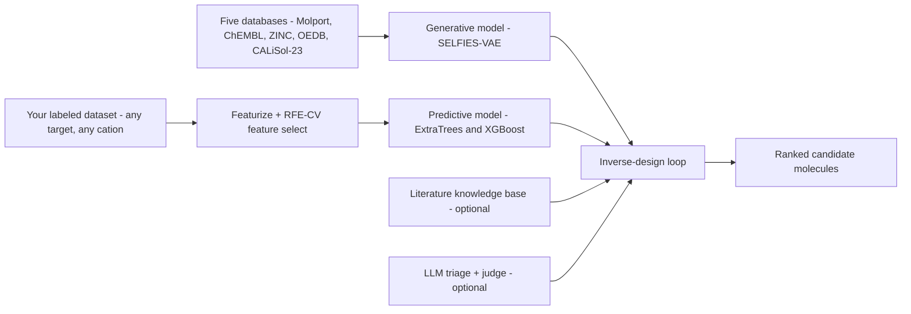
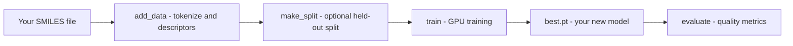
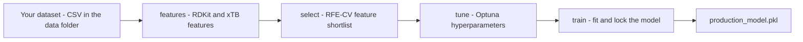
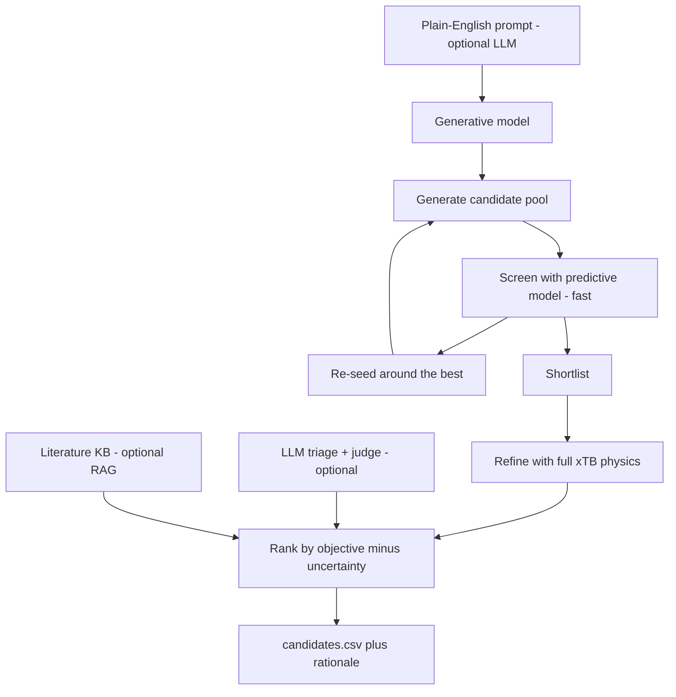

# BatteryGen

BatteryGen is an AI toolkit for **inventing new molecules** and **designing better battery
electrolyte additives**. It pairs a pretrained generative model (it dreams up novel, valid
molecules) with a predictive model (it estimates how well a molecule will perform) and ties
them together into an automated inverse-design loop.

The predictive + inverse-design pipeline is **config-driven and chemistry-agnostic**: one
small settings block (`batterygen/predictive/target.py`) points the whole pipeline at any
measured target and any working ion, so the same code designs additives for **lithium,
sodium, potassium, or zinc** batteries — you edit the config, not the code.

Under the hood the generator is a *conditional variational autoencoder* trained on
**7,116,053 molecules curated from five public chemistry databases** (Molport, ChEMBL, and
ZINC for broad chemical coverage, plus electrolyte data from OEDB and CALiSol-23), using
[SELFIES](https://github.com/aspuru-guzik-group/selfies) so that **almost every structure it
produces is chemically valid**. It learns a smooth map of chemical space that you can sample,
search, and steer toward properties you care about — and a paired predictive model ranks
candidates by predicted performance on the target you configure.



---

## Training data and provenance

BatteryGen was **not** trained on a single source. The generator was trained on **7,116,053
molecules** drawn from five public databases, filtered (3-60 heavy atoms, organic elements)
and de-duplicated:

| Database | Molecules used | Role |
|---|---|---|
| Molport "All Stock" | 6,088,143 | core corpus of purchasable molecules |
| ChEMBL-37 (sample) | 800,000 | bioactive chemical diversity |
| ZINC | 227,902 | additional lead-like diversity |
| OEDB + CALiSol-23 (solvents) | 8 | electrolyte solvents in the generator |
| **Total (generator)** | **7,116,053** | |

OEDB and CALiSol-23 are *electrolyte* datasets: beyond a handful of solvent molecules, they
contribute **18,918 electrolyte formulations** (ionic conductivity, ion coordination,
viscosity) used to train the separate **electrolyte property model**, which scores generated
molecules for battery-relevant performance across cations (Li / Na / K / Mg / Zn / ...). This is
how BatteryGen targets **battery electrolytes** rather than only general organic chemistry: the
generator proposes structures, and the predictive model - grounded in real measured data -
ranks them.

## How BatteryGen differs from existing models

- **A latent space, not left-to-right text generation.** Autoregressive models (e.g.
  ElectrolyteGPT, MolGPT) emit one token at a time. BatteryGen's VAE gives a continuous latent
  space you can **interpolate** and **optimize with gradients** - for example "increase
  molecular weight by 10 while keeping everything else," which a token model cannot do.
- **Validity by construction.** Because it decodes SELFIES, essentially **100%** of generated
  strings are valid molecules (measured validity 1.000), versus SMILES-based models that
  routinely emit invalid strings.
- **A complete inverse-design system, not just a generator.** BatteryGen pairs the generator with
  a **predictive model** (with RFE-CV feature selection and Optuna tuning), optional **LLM**
  guidance, and a **literature-grounded** retrieval step - an end-to-end loop from a
  plain-English request to a ranked, scored candidate list.
- **Chemistry-agnostic by configuration.** One config block retargets the whole pipeline to a
  new working ion or measured property (Li / Na / K / Zn / ...) without touching the code.
- **Open and laptop-friendly.** Runs on an ordinary CPU, installs with `pip`, and the weights
  are openly available.

## Benchmark results

Measured on `best.pt`, 5,000 generated samples at temperature 0.9:

| Metric | Value |
|---|---|
| Validity | 1.000 |
| Uniqueness | 0.998 |
| Novelty (vs. training set) | 0.995 |
| Internal diversity | 0.894 |
| Reconstruction (exact) | 0.945 |
| Reconstruction (token accuracy) | 0.998 |

On these standard generative-benchmark columns, BatteryGen is competitive with - and on several
columns exceeds - the autoregressive ElectrolyteGPT (Kim et al., *JACS Au*, 2026, 6, 2288-2302).

Pretrained weights, the model card, and full evaluation details:
[huggingface.co/NealKapadia/BatteryGen](https://huggingface.co/NealKapadia/BatteryGen)

---

## Table of contents

- [Training data and provenance](#training-data-and-provenance)
- [Benchmark results](#benchmark-results)
- [How BatteryGen differs from existing models](#how-batterygen-differs-from-existing-models)

1. [What you can do](#1-what-you-can-do)
2. [What you need](#2-what-you-need)
3. [Setup, step by step](#3-setup-step-by-step)
4. [Workflow A: Generate molecules with the trained model](#4-workflow-a-generate-molecules-with-the-trained-model)
5. [Encode, decode, and score molecules](#5-encode-decode-and-score-molecules)
6. [Workflow B: Fine-tune the model on your own molecules](#6-workflow-b-fine-tune-the-model-on-your-own-molecules)
7. [Workflow C: Train the generative model from scratch](#7-workflow-c-train-the-generative-model-from-scratch)
8. [Configure your target (any chemistry)](#8-configure-your-target-any-chemistry)
9. [Workflow D: Build the predictive model (featurize, select, tune, train)](#9-workflow-d-build-the-predictive-model-featurize-select-tune-train)
10. [Workflow E: Run the full inverse-design pipeline](#10-workflow-e-run-the-full-inverse-design-pipeline)
11. [The literature knowledge base (RAG)](#11-the-literature-knowledge-base-rag)
12. [Enabling natural-language features (LLM keys)](#12-enabling-natural-language-features-llm-keys)
13. [Project layout](#13-project-layout)
14. [Command reference](#14-command-reference)
15. [Troubleshooting](#15-troubleshooting)
16. [License and attribution](#16-license-and-attribution)

Every step below is shown as `python -m batterygen.<module>`, which works from the folder that
contains the `batterygen` package and after a `pip install`. Installing also creates equivalent
short commands (see [Command reference](#14-command-reference)) if you prefer them.

---

## 1. What you can do

- **Generate** new, valid, novel molecules, optionally aimed at target properties (Workflow A).
- **Fine-tune** the trained model on your own molecules (Workflow B).
- **Train** a fresh generative model from scratch on your own data (Workflow C).
- **Configure a target** for any chemistry - Li / Na / K / Zn or any measured property (Section 8).
- **Build a predictive model** that shortlists the most important features (RFE-CV), tunes with
  Optuna, and locks a scored regressor (Workflow D).
- **Run the full inverse-design pipeline** to propose and rank candidate molecules, optionally
  guided by plain-English requests and grounded in your own literature (Workflows E and 11).

Everything runs on an ordinary laptop. A computer with an NVIDIA GPU is faster but not required.

---

## 2. What you need

- **Python 3.10 or newer.** Check with `python --version`.
- **About 1 GB of free disk space** for the model weights and dependencies.
- **(Optional) An NVIDIA GPU** for faster generation and training.
- **(Optional) The xTB program** ([install guide](https://xtb-docs.readthedocs.io/)) only for
  the quantum-chemistry features (full-accuracy predictive model, or DFT grounding).
- **(Optional) Language-model API keys** only for the natural-language and literature features
  (Sections 11 and 12).

The core generative features need none of the optional items.

---

## 3. Setup, step by step

### Step 1 - Install Python

If `python --version` is below 3.10, install it from
[python.org/downloads](https://www.python.org/downloads/). On Windows, check
"Add Python to PATH" during installation.

### Step 2 - Download the code

```bash
git clone https://github.com/NealKapadia/BatteryGen.git
cd batterygen
```

(No git? Use the green "Code" button on GitHub, then "Download ZIP", unzip, and open a
terminal in that folder.)

### Step 3 - (Recommended) Create a clean environment

```bash
python -m venv batterygen-env
# Activate it:
#   Windows (PowerShell):  batterygen-env\Scripts\Activate.ps1
#   macOS / Linux:         source batterygen-env/bin/activate
```

### Step 4 - Install BatteryGen

```bash
pip install .              # core: generate, encode/decode, score, fine-tune
pip install ".[full]"      # everything: predictive pipeline, training tools, reports, LLM
```

You can install one capability at a time, for example `pip install ".[predict]"` (the
predictive + inverse-design pipeline) or `pip install ".[llm]"` (natural-language features).

Skipping Step 2 and installing straight from GitHub works too:

```bash
pip install "git+https://github.com/NealKapadia/BatteryGen.git"
```

> **NVIDIA GPU users:** install the CUDA build of PyTorch *first*, then the command above:
> `pip install torch --index-url https://download.pytorch.org/whl/cu124`

### Step 5 - Get the model weights

The trained weights (about 0.5 GB) live on Hugging Face, separate from the code. The easiest
option is to let the code download them automatically on first use (Workflow A). To download
them yourself into a folder you control:

```python
from huggingface_hub import snapshot_download
print("Weights at:", snapshot_download("NealKapadia/BatteryGen"))
```

This folder holds `checkpoints/best.pt` (the model) and `processed/` (vocabulary and
normalization files). The code finds it automatically; you can also set the environment
variable `BATTERYGEN_ART_DIR` to point at it.

> **Tip for the training, fine-tuning, and predictive workflows:** those write new files into
> the weights folder, so use a **writable copy** rather than the read-only download cache.
> Stage one once:
> ```bash
> python -c "from huggingface_hub import snapshot_download; import shutil; shutil.copytree(snapshot_download('NealKapadia/BatteryGen'),'artifacts',dirs_exist_ok=True)"
> ```
> then point at it:
> `export BATTERYGEN_ART_DIR="$PWD/artifacts"` (Windows PowerShell: `$env:BATTERYGEN_ART_DIR = "$PWD\artifacts"`).

---

## 4. Workflow A: Generate molecules with the trained model

The quickest check, from the command line:

```bash
python -m batterygen.core.api --n 20
python -m batterygen.core.api --n 10 --spec '{"MolWt":250,"NumAromaticRings":1}'
python -m batterygen.core.api --n 10 --device cuda --out molecules.csv
```

Or from Python - create `try_it.py` and run `python try_it.py`:

```python
from huggingface_hub import snapshot_download
from batterygen import BatteryGen

# Loads the model (downloads weights on first run). Use device="cuda" if you have a GPU.
bg = BatteryGen(device="cpu", artifacts_dir=snapshot_download("NealKapadia/BatteryGen"))

print(bg.generate(10))                                    # 10 valid, novel molecules
print(bg.generate(5, spec={"MolWt": 300, "QED": 0.8}))    # aimed at target properties
for row in bg.generate(5, with_properties=True):          # molecules plus their properties
    print(row)
```

Property targets are *soft*: the model moves toward them but does not hit them exactly. For
strict requirements, generate extra molecules and filter by their computed properties.

---

## 5. Encode, decode, and score molecules

```python
z = bg.encode("OCCN(CCO)CCO")   # molecule -> 256-number latent vector
bg.decode(z)                     # latent vector -> molecule
bg.properties("CCO")             # standard RDKit descriptors
bg.predict_properties("CCO")     # the model's own property predictions
```

To explore variations around a molecule, encode it, nudge the vector, and decode:

```python
import numpy as np
z = bg.encode("CC(=O)[O-]")
for _ in range(10):
    print(bg.decode(z + np.random.randn(*z.shape).astype("float32") * 0.6))
```

---

## 6. Workflow B: Fine-tune the model on your own molecules

Fine-tuning adapts the trained model toward your chemistry. It builds its training set
directly from a text file of SMILES, so it does **not** need the original training data.

1. Put your molecules in a file, one SMILES per line, e.g. `my_molecules.smi`.
2. Point `BATTERYGEN_ART_DIR` at a **writable** copy of the weights (see the tip in Step 5).
3. Fine-tune:

```bash
python -m batterygen.core.finetune --input my_molecules.smi --epochs 3          # add --device cuda for a GPU
python -m batterygen.core.finetune --input solvents.csv --smiles-col 0 --header --delim ,   # CSV input
```

The result is saved as `artifacts/checkpoints/finetuned.pt`. Use it:

```python
from batterygen import BatteryGen
bg = BatteryGen(device="cpu", ckpt="artifacts/checkpoints/finetuned.pt")
print(bg.generate(20))
```

A pure-CPU laptop handles a few thousand molecules and a few epochs comfortably (just more
slowly than a GPU). Your molecules are filtered by the same rules as the base model (3 to 60
heavy atoms, common organic elements); the run prints how many survived.

---

## 7. Workflow C: Train the generative model from scratch

Use this to build a brand-new model on your own dataset instead of adapting the existing one.
A GPU is strongly recommended; on CPU it is only practical for small datasets.



1. Choose a writable output folder for all artifacts:

   ```bash
   export BATTERYGEN_ART_DIR="$PWD/my_model"     # Windows PowerShell: $env:BATTERYGEN_ART_DIR = "$PWD\my_model"
   ```

2. Convert your SMILES into training data (this also builds the vocabulary and the property
   normalization statistics):

   ```bash
   python -m batterygen.generative.add_data --input mydata.smi --tag mydata --recompute-stats
   ```

3. (Optional but recommended) Create an honest held-out validation split:

   ```bash
   python -m batterygen.generative.make_split
   ```

4. Train. The model checkpoints periodically and can be stopped and resumed at any time:

   ```bash
   python -m batterygen.generative.train --epochs 6 --batch 320       # lower --batch on small GPUs
   python -m batterygen.generative.train --resume                      # continue a stopped run
   ```

   The best checkpoint is saved as `best.pt` in your artifacts folder.

5. Check quality against standard generative metrics:

   ```bash
   python -m batterygen.generative.evaluate
   ```

Your new model loads exactly like the pretrained one:
`BatteryGen(ckpt="my_model/checkpoints/best.pt")`.

---

## 8. Configure your target (any chemistry)

Everything the predictive + inverse-design pipeline needs to know about **your** problem lives
in one file: [`predictive/target.py`](predictive/target.py). This is the only place you edit to
retarget the pipeline - no column name, cation, or objective is hardcoded anywhere else.

```python
TARGET = TargetConfig(
    # data schema (must match your CSV headers)
    smiles_col     = "Additive_SMILES",
    target_col     = "CE_aver. (%)",
    context_cols   = ["LogMolarRatio"],       # extra numeric CSV columns -> features
    replicate_cols = ["CE_1 (%)", "CE_2 (%)", "CE_3 (%)"],   # [] to disable the noise filter
    maximize       = True,                     # maximize (True) or minimize (False) the target
    target_transform = "lce",                  # "none" (default) or "lce" for a 0-100% efficiency target

    # feature selection
    use_xtb        = True,                     # include GFN2-xTB electronic features
    n_features     = None,                     # None = RFE-CV auto; an int forces the top-K
    pin_context    = True,                     # always keep the context columns through selection

    # chemistry framing (drives every LLM + RAG prompt)
    system     = "aqueous zinc-metal battery electrolyte additive",
    objective  = "maximize zinc plating/stripping Coulombic efficiency (CE)",
    cation     = "Zn2+",
    fatal_flag = "unstable-in-water",          # stability label that eliminates a candidate
)
```

**Switch chemistry in one line.** Ready-made presets ship for `Zn`, `Li`, `Na`, and `K`:

```bash
export BATTERYGEN_TARGET=Li      # Windows PowerShell: $env:BATTERYGEN_TARGET = "Li"
```

or edit the last line of `target.py` (`TARGET = PRESETS["Zn"]`). When you bring your own
dataset, edit the `*_col` fields to match your CSV headers. That is the whole change needed to
design lithium, sodium, or potassium additives instead of zinc.

---

## 9. Workflow D: Build the predictive model (featurize, select, tune, train)

The predictive model estimates your configured target from a molecule's structure. It needs
the `predict` extra (`pip install ".[predict]"`), your labeled dataset, and - for the
physics-based features - the xTB program.



1. **Provide your dataset.** Put a single CSV in a `data/` folder (the tools detect it
   automatically), or pass `--csv your.csv`, or set the `BATTERYGEN_CE_CSV` environment variable.
   The CSV columns must match the names in your `target.py` (Section 8). Then build the feature
   table (this runs xTB once per molecule and caches it, so re-runs are fast):

   ```bash
   python -m batterygen.predictive.features               # auto-detects the CSV in data/
   # or:  python -m batterygen.predictive.features --csv path/to/your.csv
   # add --no-xtb to skip the physics features
   ```

2. **Shortlist the features that matter** with Recursive Feature Elimination + scaffold-grouped
   cross-validation (RFE-CV). It keeps only the columns that actually move the target and writes
   the shortlist to `selected_features.json`:

   ```bash
   python -m batterygen.predictive.select
   ```

3. **Tune hyperparameters with Optuna** (optional). It searches many settings and keeps the
   best, scoring on both random and scaffold splits for an honest estimate:

   ```bash
   python -m batterygen.predictive.tune
   ```

4. **Train and save** the final predictor on the shortlisted features:

   ```bash
   python -m batterygen.predictive.train
   ```

   The model is written to `<artifacts>/predictive/production_model.pkl`, and the run prints
   honest accuracy (R-squared) for both random and scaffold splits.

**Improve past the ceiling with active learning.** The predictor learns from measured data and
cannot reliably predict values better than the best it has seen. The dependable way past that
ceiling is to measure a promising candidate, add the measurement, and retrain:

```bash
python -m batterygen.predictive.features --append-smiles "<SMILES>" --append-value 98.5
python -m batterygen.predictive.select
python -m batterygen.predictive.train
```

---

## 10. Workflow E: Run the full inverse-design pipeline

With the generative model (Workflow A or C) and the predictive model (Workflow D) in place,
this closes the loop: it generates many candidates, screens them with the predictor, re-seeds
generation around the best, refines the shortlist with full xTB physics, optionally runs an LLM
triage + judge, and writes a ranked list of proposed molecules.



Basic run:

```bash
python -m batterygen.predictive.design --n 1200 --rounds 3 --shortlist 60 --top 30 --out candidates.csv
```

The output `candidates.csv` ranks candidates by predicted performance minus an uncertainty
penalty (respecting the `maximize` direction in your config), with their properties and (where
available) their Molport catalog IDs.

Guide the search with plain English and add a language-model review of each candidate (needs
the keys from Section 12):

```bash
python -m batterygen.predictive.design --prompt "small water-stable additive, molecular weight under 200" --llm
```

Ground the explanation of the top candidate in your own literature and flag novelty against it
(needs a knowledge base, see Section 11):

```bash
python -m batterygen.predictive.design --prompt "amide additive for the anode SEI" --llm --rag
```

See `python -m batterygen.predictive.design --help` for all options (round count, shortlist size,
uncertainty penalty `--lam`, a direction-aware `--min-target` filter, context overrides
`--context "LogMolarRatio=-1.5"`, and more).

---

## 11. The literature knowledge base (RAG)

The optional knowledge base lets the pipeline ground its explanations in real papers and notes
*you* provide, and flag candidates that are too similar to already-published work. It uses
text embeddings, so it needs the embedding key from Section 12.

**Where the files live:** the knowledge base is stored under your artifacts folder at
`<BATTERYGEN_ART_DIR>/predictive/kb/` (created automatically). You do not place files there by hand
- you add them with the commands below, which read, chunk, and embed your text.

**Add documents** (plain-text papers, abstracts, or your own notes). Use `--source` to label
where each came from so citations are meaningful:

```bash
# add a text file (export a paper to .txt first):
python -m batterygen.predictive.rag --add paper.txt --source "Zhang 2024 JACS"

# add a quick note directly:
python -m batterygen.predictive.rag --add-text "TFE additive raises CE to 99.4% by reshaping the SEI." --source "lab note"
```

**Inspect and search** the knowledge base:

```bash
python -m batterygen.predictive.rag --list                                # what is in the KB
python -m batterygen.predictive.rag --query "amide additives for the SEI" --k 5   # top 5 passages
```

**Use it in the pipeline** by adding `--rag` to a design run (Section 10). The top candidate's
explanation will cite retrieved passages, and the output CSV gains a `lit_novelty` column
(higher means less similar to anything in your knowledge base, i.e. more novel).

By default the knowledge base is capped at 50 documents. Raise it by setting
`CE_RAG_MAX_SOURCES`, e.g. `export CE_RAG_MAX_SOURCES=200`.

---

## 12. Enabling natural-language features (LLM keys)

The `--llm` and `--rag` features use a language model and text embeddings. These are optional
and off by default; without keys, the pipeline still runs (it falls back to keyword matching
and skips the literature grounding).

1. Copy the example configuration:

   ```bash
   cp .env.example .env       # Windows: copy .env.example .env
   ```

2. Open `.env` in a text editor and fill in your keys. The file supports Azure AI Foundry and
   Azure OpenAI endpoints (used as the reasoning, fast, judge, and embedding models):

   ```
   FOUNDRY_API_KEY=your-key-here
   FOUNDRY_ENDPOINT=https://your-resource.services.ai.azure.com/openai/v1
   AZURE_OPENAI_KEY=your-key-here
   AZURE_OPENAI_ENDPOINT=https://your-resource.openai.azure.com/openai/v1
   ```

3. Save the file. The language-model features pick it up automatically. The embedding key
   (`FOUNDRY_API_KEY`) is what powers the knowledge base in Section 11.

**Never share or commit your `.env` file.** It is excluded from the repository on purpose.

---

## 13. Project layout

The code is grouped into subpackages by purpose. Every module runs with
`python -m batterygen.<subpackage>.<module>`:

```
batterygen/
  core/         the model and data layer (config, data, model, infer, api, finetune, membership, llm)
  generative/   train and evaluate the generative model (train, preprocess, add_data, generate, ...)
  predictive/   the config-driven predictive model + inverse design:
                  target      the one settings block (edit this to retarget)
                  features    RDKit + xTB feature cache
                  select      RFE-CV feature shortlisting
                  tune        Optuna hyperparameter search
                  train       fit and lock the model (+ the predict() backbone)
                  design      the full generate -> predict -> LLM/RAG loop
                  design_llm  LLM triage / judge / rationale
                  rag         literature knowledge base
                  sampling    generator-interface helpers
  electrolyte/  formulation-level property models (electrolyte, electrolyte_data, solvent_lib)
  grounding/    quantum-chemistry grounding (xtb_label, qm9, finetune_dft)
  tests/        the automated test suite
  data/         put your own CSV datasets here
```

You normally interact through `python -m batterygen.<module>` (Section 14) or the `BatteryGen`
Python class, not the files directly.

---

## 14. Command reference

Each row shows the module form and the short console command created on install (either works).

| Module command | Short command | What it does |
|---|---|---|
| `python -m batterygen.core.api` | `batterygen` | Generate molecules from the command line. |
| `python -m batterygen.core.finetune` | `batterygen-finetune` | Fine-tune the model on your own SMILES. |
| `python -m batterygen.generative.add_data` | `batterygen-add-data` | Turn your SMILES into training data. |
| `python -m batterygen.generative.make_split` | `batterygen-make-split` | Create a held-out validation split. |
| `python -m batterygen.generative.train` | `batterygen-train` | Train the generative model. |
| `python -m batterygen.generative.evaluate` | `batterygen-evaluate` | Benchmark generation quality. |
| `python -m batterygen.predictive.features` | `batterygen-pred-features` | Build the predictive-model feature table. |
| `python -m batterygen.predictive.select` | `batterygen-pred-select` | Shortlist features with RFE-CV. |
| `python -m batterygen.predictive.tune` | `batterygen-pred-tune` | Optuna hyperparameter tuning. |
| `python -m batterygen.predictive.train` | `batterygen-pred-train` | Train and save the predictive model. |
| `python -m batterygen.predictive.design` | `batterygen-pred-design` | Run the full inverse-design pipeline. |
| `python -m batterygen.predictive.rag` | `batterygen-pred-rag` | Manage the literature knowledge base. |
| `python -m batterygen.generative.{generate,search,report}` | `batterygen-{generate,search,report}` | CLI generation, latent search, HTML report. |
| `python -m batterygen.electrolyte.electrolyte` etc. | `batterygen-electrolyte`, `batterygen-xtb-label`, `batterygen-qm9`, `batterygen-finetune-dft` | Electrolyte and quantum-grounding tools. |

Every command supports `--help`.

---

## 15. Troubleshooting

- **`python -m batterygen...` says "No module named batterygen"** - run it from the folder that
  contains the `batterygen` package (its parent directory), or `pip install .` so the package is
  importable from anywhere.
- **A short command like `batterygen-train` is "not found"** - make sure the install finished
  (`pip install ".[full]"`) and that your environment is activated. The module form always
  works: `python -m batterygen.generative.train --help`.
- **"weights not found"** - set `BATTERYGEN_ART_DIR` to the folder where the weights were
  downloaded (Step 5), or pass `artifacts_dir=...` to `BatteryGen(...)`.
- **Training, fine-tuning, or predictive steps cannot write output** - point `BATTERYGEN_ART_DIR`
  at a *writable* copy of the weights, not the read-only download cache (see the tip in Step 5).
- **No dataset found** - put a single CSV in a `data/` folder, pass `--csv`, or set
  `BATTERYGEN_CE_CSV` (Section 9).
- **Out of memory on a GPU** - lower the batch size, e.g. `--batch 32`.
- **xTB errors** - confirm xTB is installed and set the `XTB_EXE` environment variable to its
  executable, or build features with `--no-xtb` to skip the physics features.
- **`--llm` or `--rag` do nothing** - they need API keys in `.env` (Section 12).

---

## 16. License and attribution

Both the **code and the model weights** are released under **CC BY-NC 4.0** (Attribution,
NonCommercial) - see the [LICENSE](LICENSE) file. The weights are derived from the Molport
"All Stock" catalog, which is itself CC BY-NC 4.0, so the same terms apply: you must credit
BatteryGen and Molport, and you may not use the project for commercial purposes. See the
[Hugging Face model card](https://huggingface.co/NealKapadia/BatteryGen) for details.
